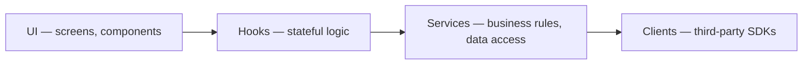

{{projectName}} keeps a one-way dependency flow:

Nothing points back up. A service that imports a component, or two modules that
import each other, is a structural bug even when it compiles.

Third-party SDKs are initialised in exactly one client module each and used
through a thin project wrapper. That is what makes them mockable in tests,
replaceable without touching feature code, and easy to find when their API
changes.
