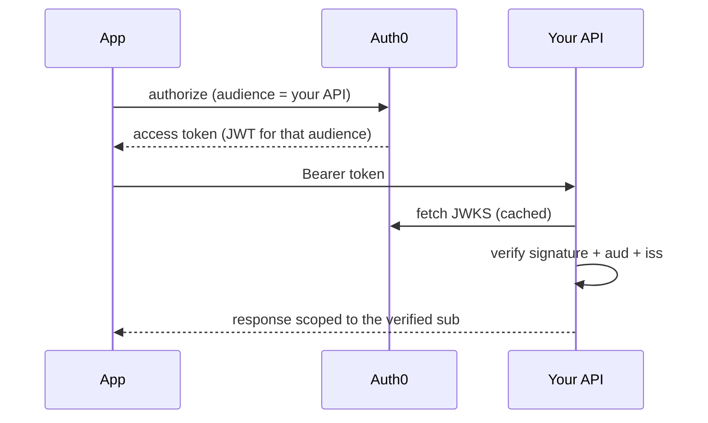
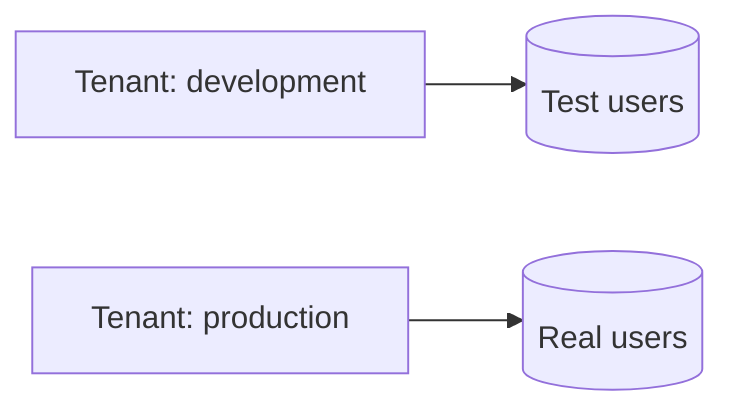

Auth0 issues the token; your API decides what it permits.

The `audience` is what makes the token a verifiable JWT rather than an opaque
reference. Omit it and every step after it fails, with an error that describes
the symptom rather than the cause.

Verifying `aud` matters as much as the signature: a token minted by the same
tenant for a different API is correctly signed, and accepting it lets any
application in the tenant call yours.

