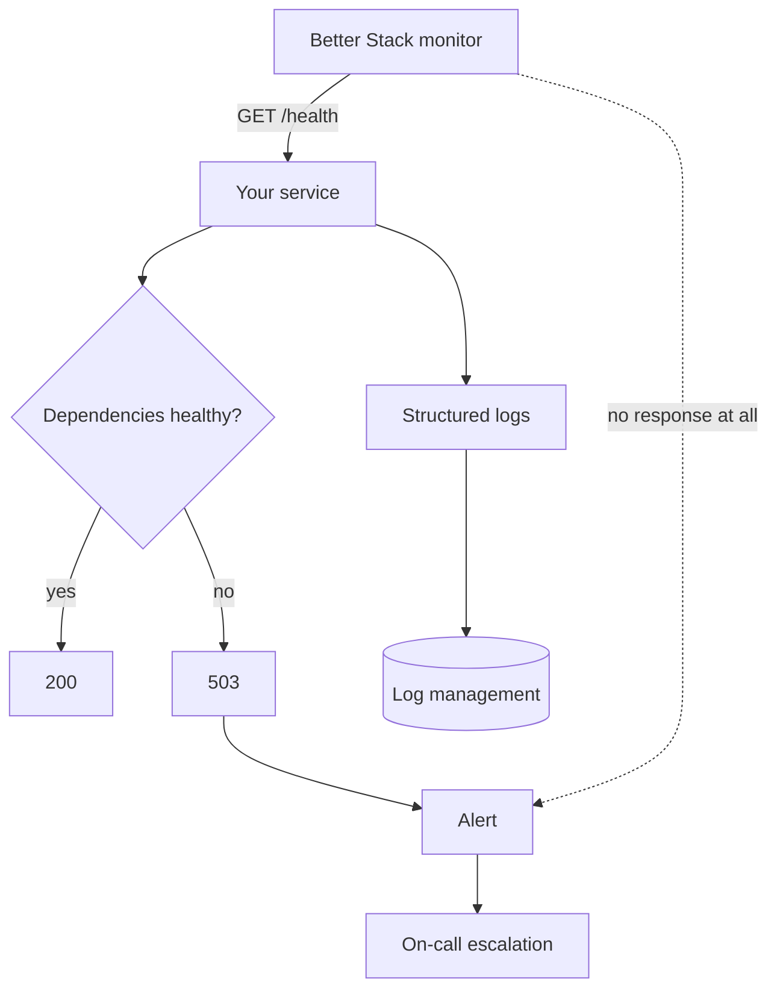
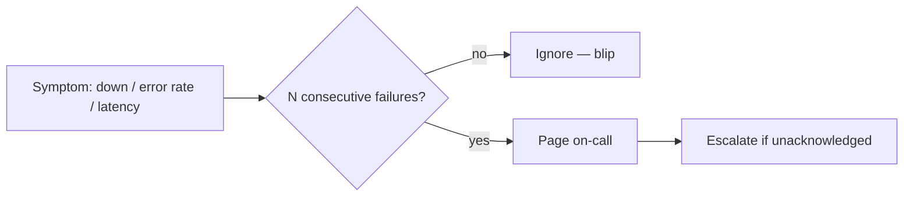

Monitoring watches from outside the system, which is what lets it catch failures
the system itself cannot report.

The dotted path is the one that matters. When the service is unreachable, an
in-process error reporter has nothing to send — only an external check notices.

The health endpoint therefore has to be honest: if it returns 200 without
testing the database, the monitor stays green through an outage.

### Alert routing

Requiring consecutive failures is what separates an incident from a network
blip, and it is the difference between alerts people act on and alerts people
mute.
