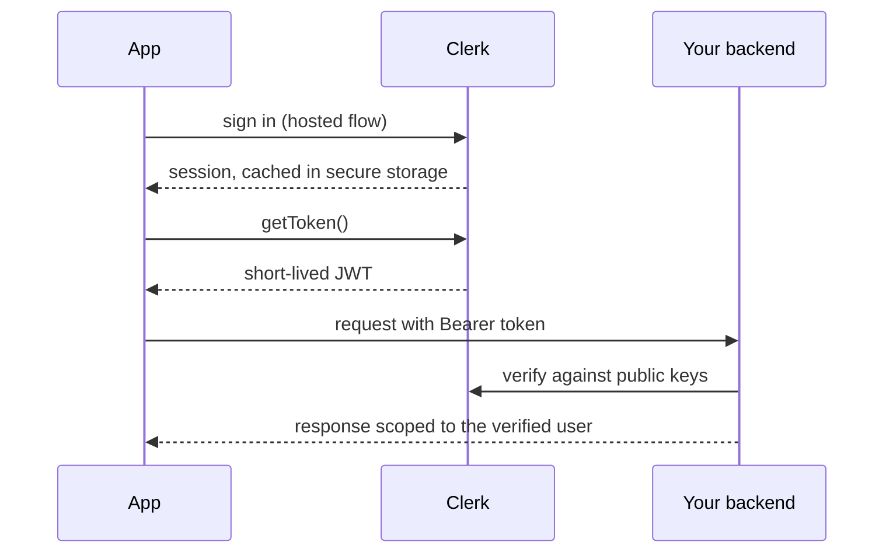
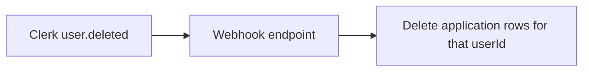

Clerk owns the user record. Your database owns everything else, joined by
Clerk's user id.

The verification step is the security boundary. A user id in a request body is
attacker-controlled; only the verified token identifies the caller.

### Keeping the two sides in sync

Without that webhook, deleting a user in Clerk leaves their application data
behind indefinitely.
