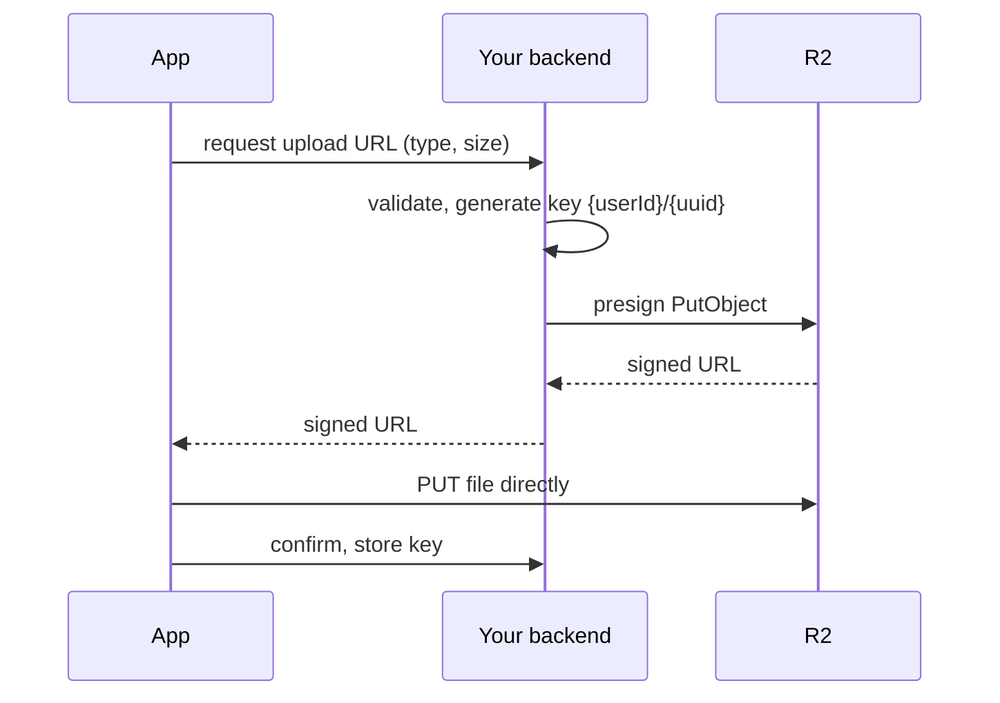
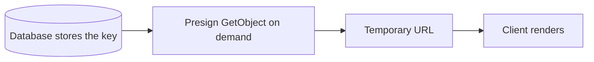

The client never holds a credential. Your backend mints short-lived presigned
URLs, and the upload itself goes straight to R2.

Two properties of this shape matter:

**The backend chooses the key.** A client-supplied key would let one user write
over another's object with a request that looks entirely legitimate.

**Validation happens before signing.** The signed URL is a capability — once
issued it works until it expires, so checking the file afterwards is too late.

