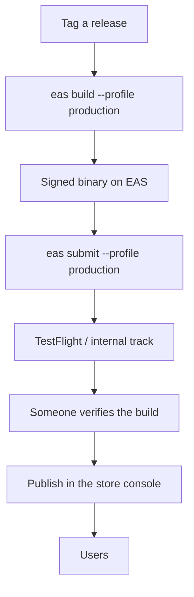
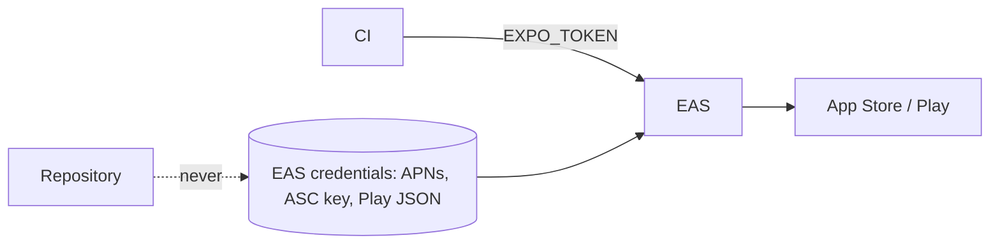

Build and submit are separate steps, and neither one releases the app.

The last two steps are deliberately manual. Automating all the way to `users`
removes the point at which a person confirms this is the build they intended,
and store releases are slow and awkward to reverse.

### Credential flow

No store credential lives in the repository. EAS holds them, CI holds only the
token that authorises using them.
