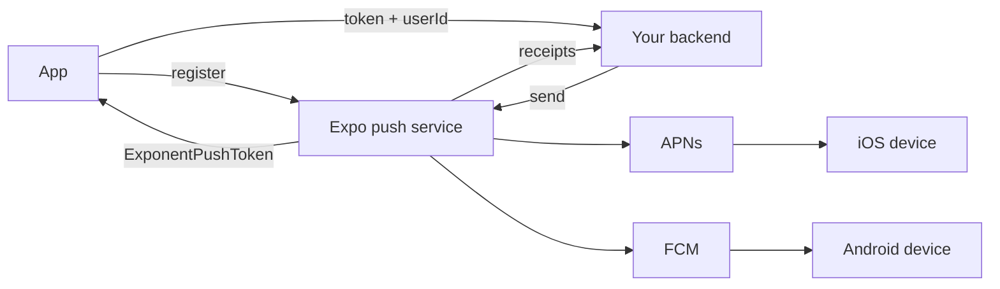
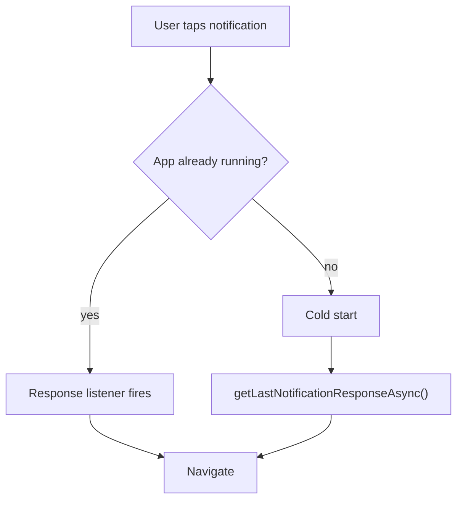

Expo's service fans out to APNs and FCM, so the app holds one token format and
the backend has one endpoint to call.

The receipts loop is not optional bookkeeping: a send returning 200 only means
Expo accepted the request. Delivery failures — most importantly
`DeviceNotRegistered` — appear later in the receipt, and those tokens must be
deleted or they accumulate forever.

### Tap handling

Only handling the listener branch loses every deep link from a cold start, which
is the most common way a notification tap "does nothing".
