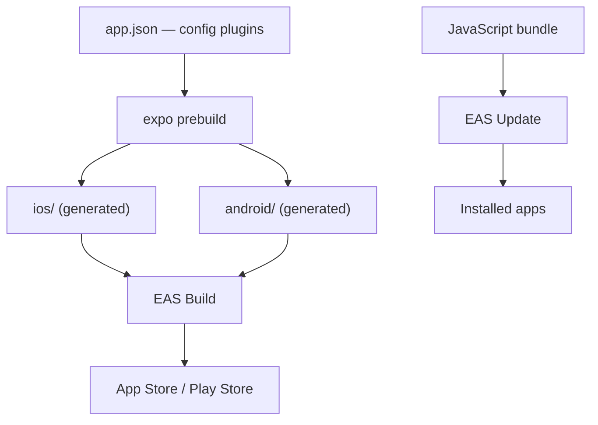

Expo owns the native layer. `app.json` is the single source of truth for native
configuration; the `ios/` and `android/` directories are build artefacts.

Two delivery paths, and the distinction matters: **EAS Build** ships a binary
and is the only way to change native code. **EAS Update** ships JavaScript over
the air, in seconds, and cannot add a native module. Sending a JS bundle that
expects a native module the installed binary lacks crashes every device that
receives it.

Deployment detail is in [deployment.md](deployment.md).
