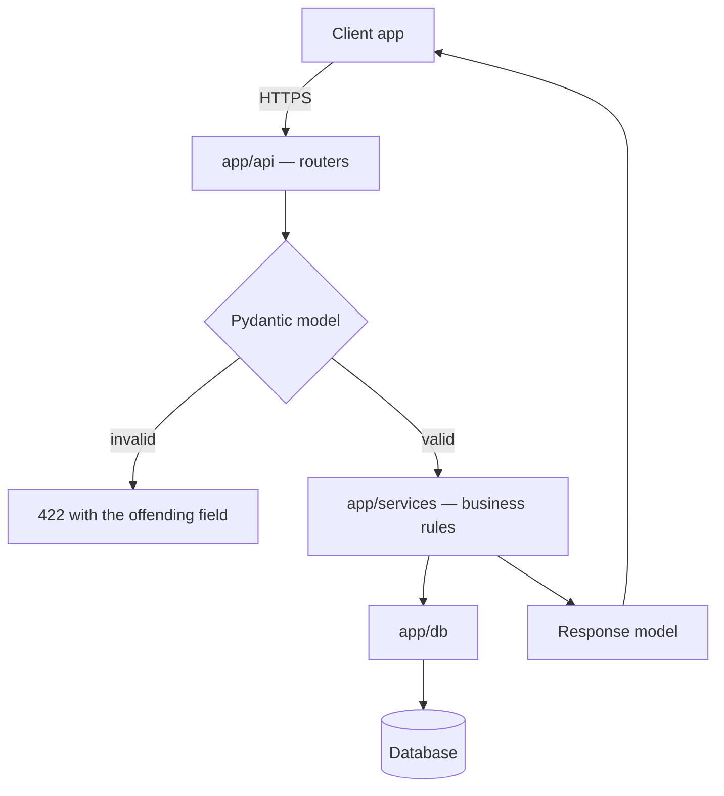
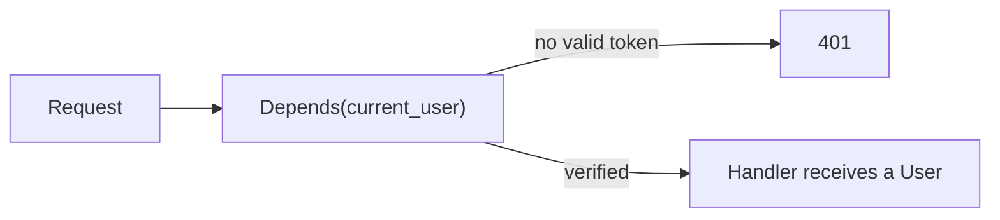

A Python service in front of the database. Handlers stay thin; the type
annotations do the validating.

Both boundaries are typed on purpose. The request model rejects bad input before
any handler code runs; the **response** model decides what leaves — which is what
stops an ORM object serialising password hashes and internal flags into a public
API.

### Auth as a dependency

Enforced by the framework rather than by a check each handler has to remember.
A new endpoint that declares the dependency is protected by construction.

### Note

This service is Python. It sits alongside the JavaScript side of the repository
with its own dependency file and its own test runner.
