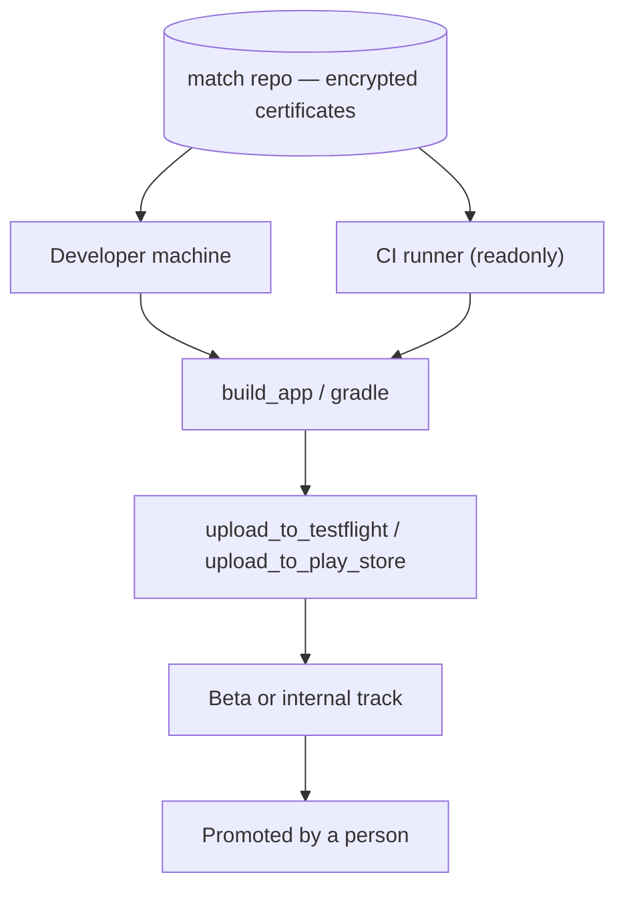
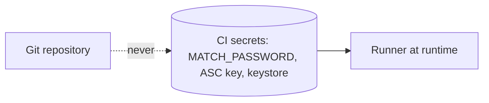

Signing identities are shared through an encrypted repository, so local machines
and CI runners produce interchangeable builds.

The `readonly` marking on CI is the load-bearing detail: a runner permitted to
write can regenerate certificates, revoking the existing ones and breaking every
other machine's builds.

### Where credentials live

Nothing signing-related is committed. Certificates are expensive to rotate —
revoking one invalidates existing builds — which makes a leak here costlier than
most.
