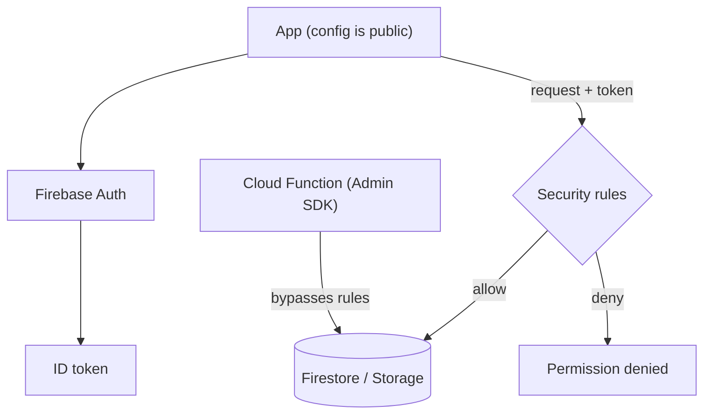
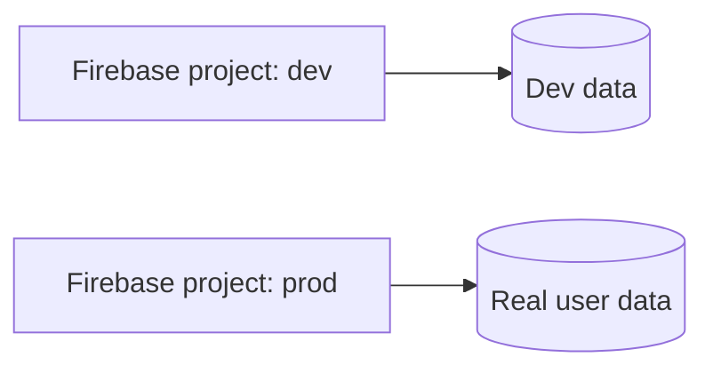

The client talks directly to Firebase. There is no server of yours in the path,
so the rules engine is the entire authorisation layer.

The `apiKey` shipped in the app identifies the project; it grants nothing. Every
read and write is evaluated against the rules using the caller's verified token,
which the client cannot forge.

That is also why the Admin SDK is dangerous in the wrong place: it takes the
bottom path and skips the rules entirely.

### Environments

Firebase has no environment concept inside a project. Separation means separate
projects — otherwise a test script writes to real user data.
