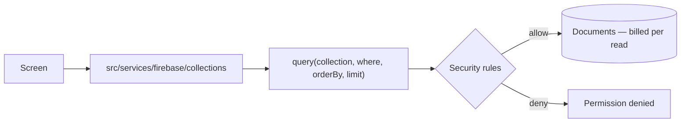
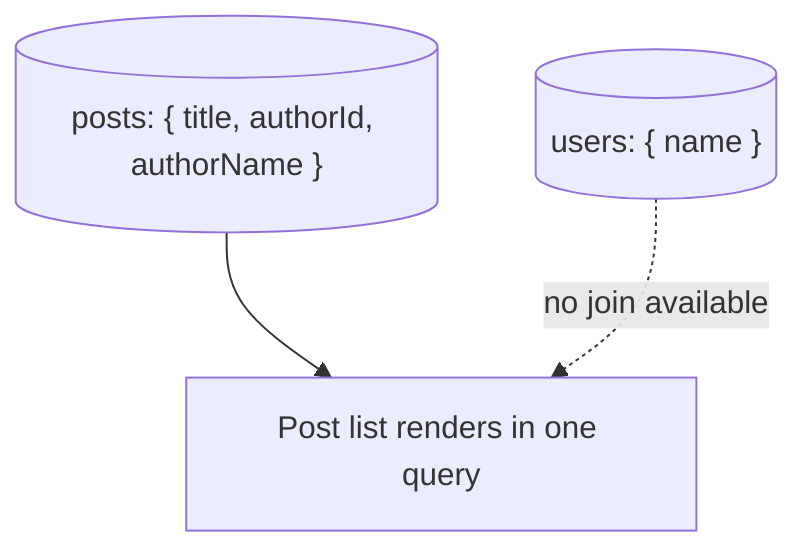

Queries go from the client to Firestore directly, filtered by rules on the way
in and billed per document on the way out.

### Why the data model looks duplicated

Storing `authorName` on the post is not sloppiness — there is no join, and
fetching each author separately turns one query into N. The cost is that
renaming a user must update every post that copied the name, so keep duplicated
fields few and slow to change.
