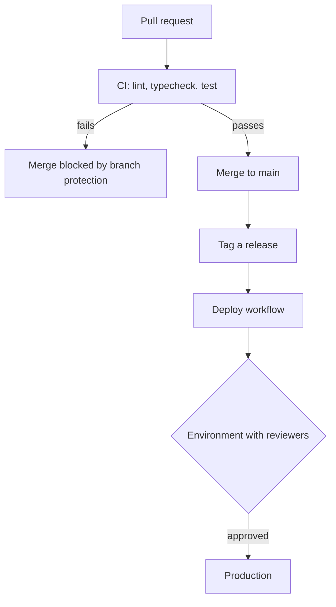
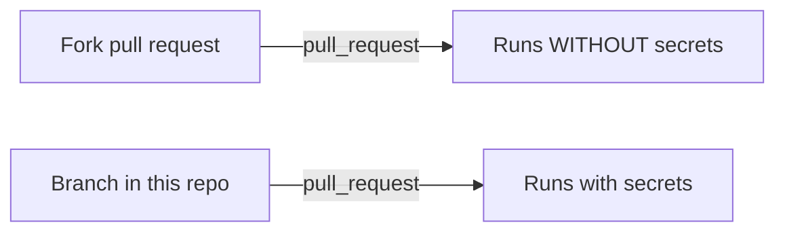

CI decides whether a change may merge. Deployment is a separate, deliberate act.

Branch protection is what makes the CI job meaningful — a workflow that cannot
block a merge is decoration.

The gap between `merge` and `deploy` is intentional. A green build means the
code is safe to ship, not that this is the right moment; the environment
approval is where a human decides.

### Secret exposure boundary

Fork runs are secret-free by design. `pull_request_target` crosses that boundary
— full secrets against contributor-controlled code — and is the reason not to
reach for it when a fork build cannot see a credential.
