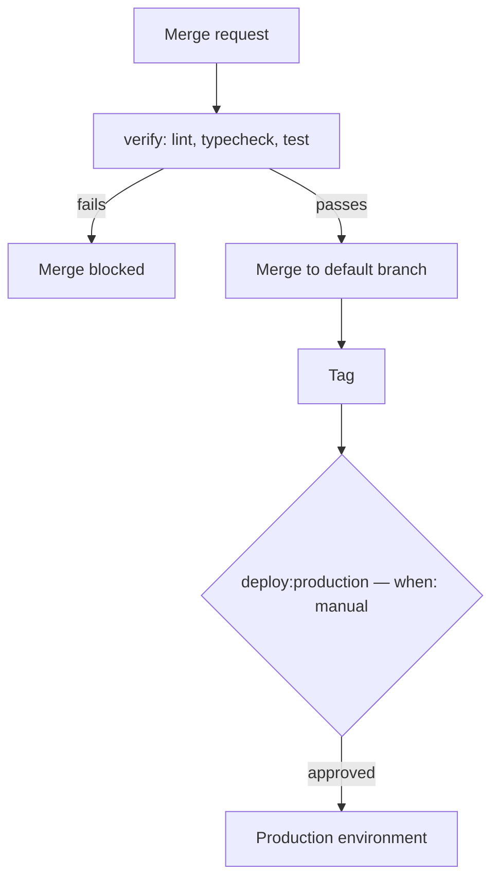
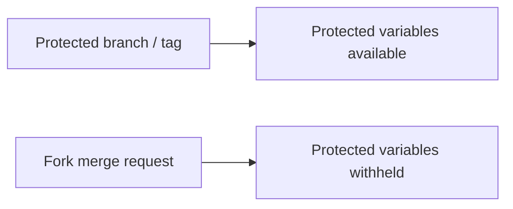

Pipelines gate the merge; deployment stays a separate manual step.

### Where variables are readable

The right-hand path is the protection doing its job. Unprotecting a variable so
a fork pipeline can read it hands your credentials to anyone who can open a
merge request — if a job truly needs them, run it after merge instead.
