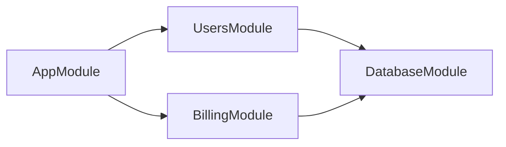

Requests pass through the framework's own gates before any of your code runs.
That ordering is the design: validation and authorisation are configuration, not
something each handler has to remember.

```mermaid
flowchart TD
  request["Request"] --> guard{"Global auth guard"}
  guard -->|no valid token| unauth["401"]
  guard -->|@Public or verified| pipe{"ValidationPipe"}
  pipe -->|invalid or unknown fields| bad["400"]
  pipe -->|clean DTO| controller["Controller — thin"]
  controller --> service["Service — business rules"]
  service --> db[("Database")]
  service --> dto["Response DTO"]
  dto --> response["Response"]
```

Two gates that are **off by default** and fail silently when missing:

- Without the global `ValidationPipe`, DTO decorators do nothing and unknown
  properties reach your service.
- Without a global guard, every new endpoint is public until somebody remembers
  to protect it.

### Modules



One module per feature, exporting only what other modules genuinely need. A
provider that is not exported cannot be reached, which keeps the graph honest.
