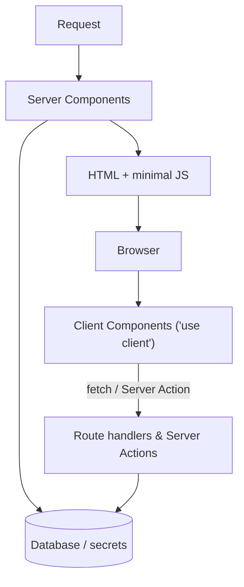
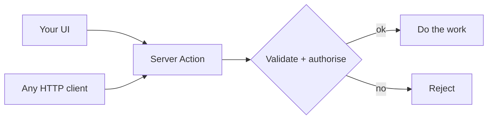

The server/client boundary is the main architectural line in a Next.js app —
more consequential than any folder layout.

Everything above the browser line can hold secrets. Everything below is public,
including any value inlined through `NEXT_PUBLIC_`.

### Why Server Actions still need authorisation

`'use server'` describes *where* code runs, not who may call it. The action is a
public endpoint reachable by anyone who can form a request, so the check belongs
inside it — not in the component that renders the button.

### Where code lives

| Kind | Location |
| --- | --- |
| Routes, layouts, pages | `app/` |
| Shared UI | `src/components/` |
| Business logic, data access | `src/services/` |
| Helpers, clients | `src/lib/` |
