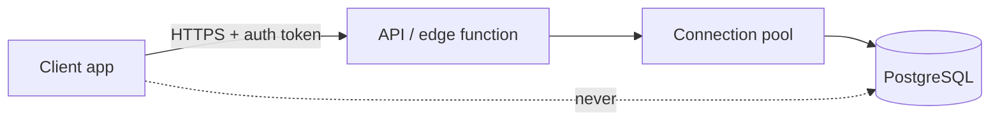
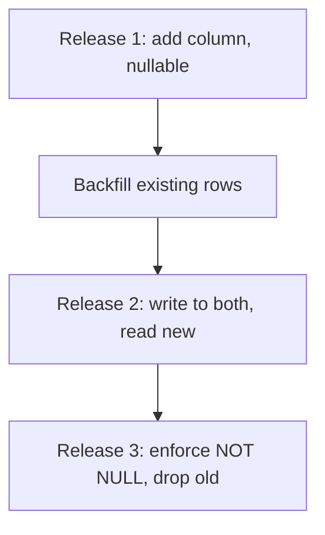
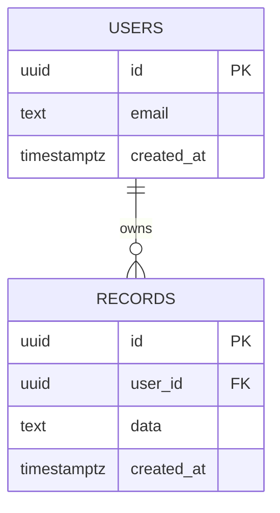

The database is never reachable from a client. An API layer sits in front and is
the only holder of credentials.

The dotted line is the rule: a connection string in a shipped app grants every
user full read and write access to every row, and no amount of obfuscation
changes that.

### Deploying a schema change safely

Each release must work against the schema on either side of it, because a
rollback deploys the previous code against the current database.

### Starter data model

Nothing here scaffolds real tables — this is a starting point to replace, not
a reflection of your actual schema. `users` owning many rows of some other
entity is the shape most schemas begin from:

