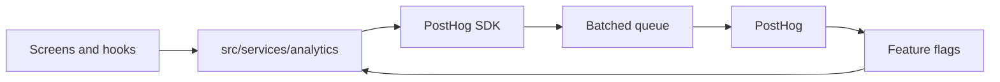
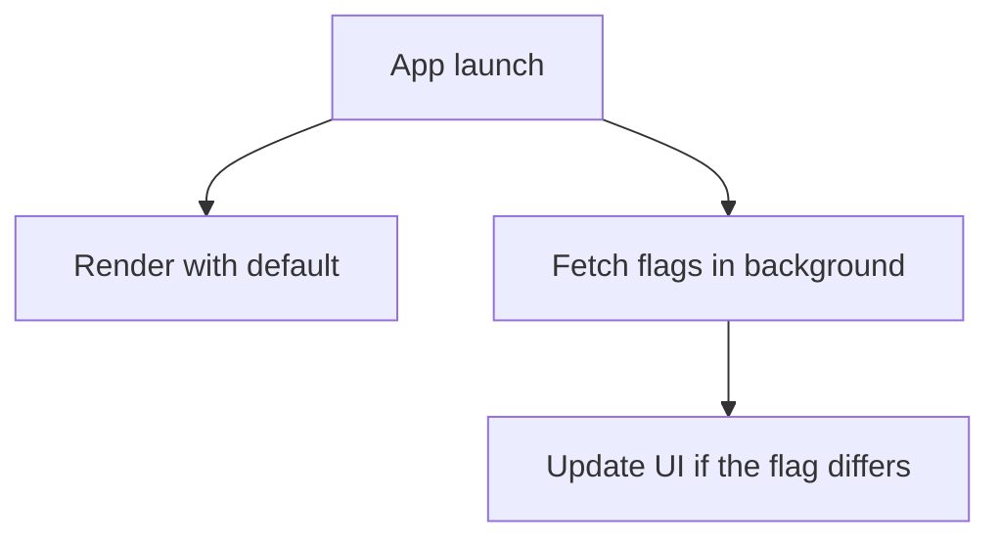

Every analytics call goes through one service, so event names stay consistent
and a provider change touches a single file.

Events are batched and sent in the background, which is why they appear in the
dashboard a little later and why a failed send must never surface to the user.

### Feature flags

Flags are fetched after launch and cached locally. The consequence for code: the
first read may be stale or unavailable, so every flag needs a default and none
may block first render.

