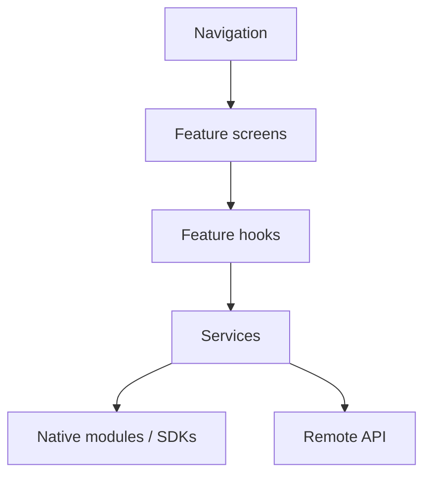

The app is a single TypeScript codebase rendering native views on both
platforms. Navigation owns routing; features own their own screens, hooks and
services.

Only `src/services/` talks to native modules or the network. That boundary is
what lets the whole UI layer be tested without a device or a network, and it
keeps a vendor SDK swap from reaching into screens.

**Package fragment note** — `package.fragment.json` adds the `ios`, `android`
and `start` scripts; the merger combines them with scripts from every other
selected module.
