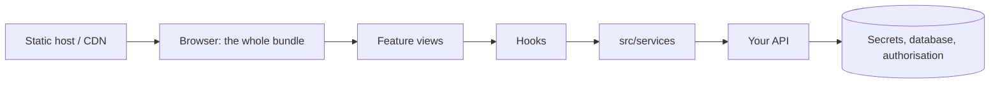
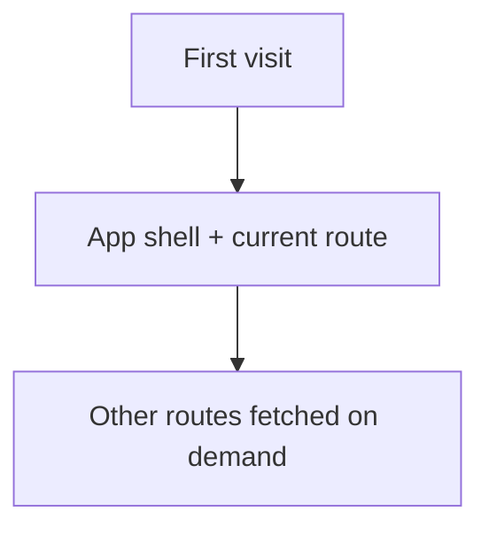

A static bundle in the browser, talking to an API. Nothing runs on a server you
control, which is what shapes every rule below.

Everything left of `api` is public. The bundle, its `VITE_*` values and any
logic inside it can be read and replayed by anyone.

So authorisation lives at the API. Hiding a control in the UI changes what a
user *sees*, never what they can *do*.

### Loading

Route-level code splitting is the difference between shipping one screen and
shipping all of them to someone who opens the login page and leaves.
