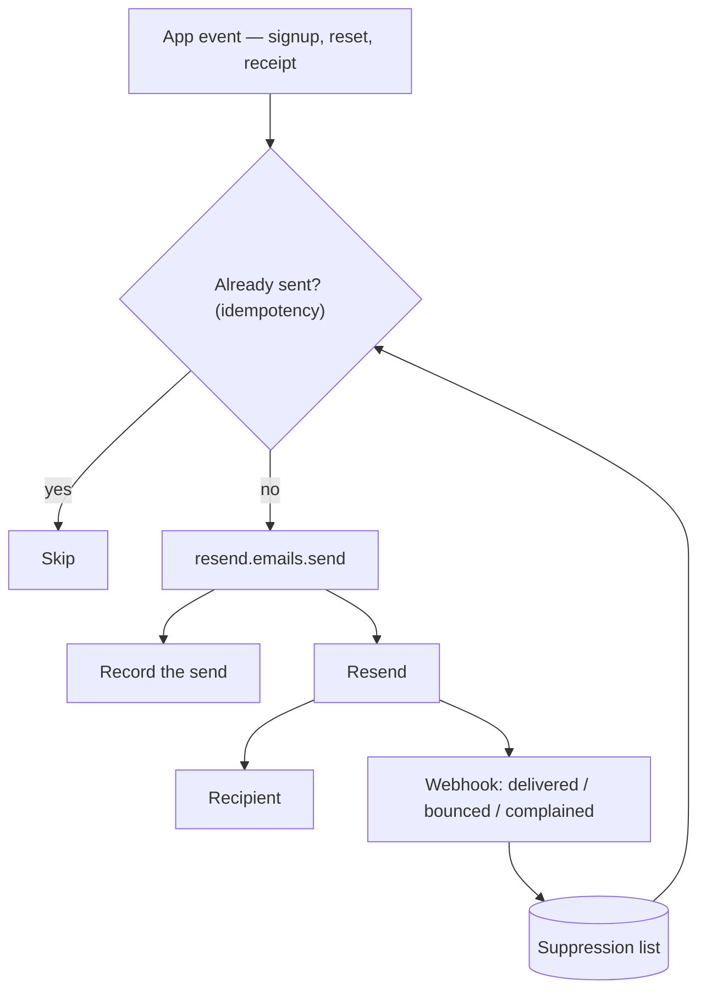

Email is sent from the server, and the bounce loop feeds back into who you are
allowed to send to next time.

The idempotency check exists because sending is irreversible: a retried webhook
or a re-queued job would otherwise mail the user again, and there is no way to
take it back.

The suppression list closes the other loop. Repeatedly sending to addresses that
bounce is what destroys sender reputation, and reputation is far slower to
rebuild than to lose.
