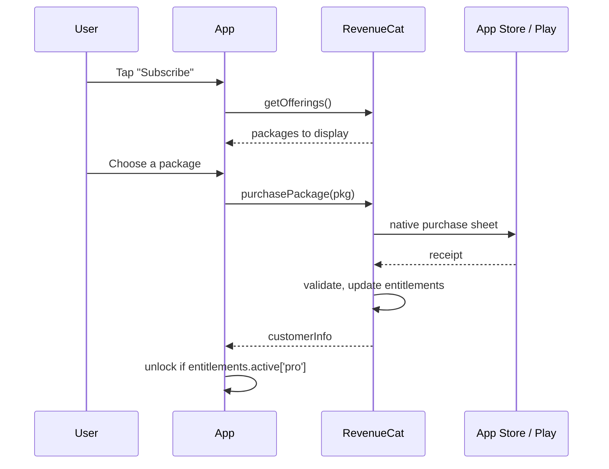
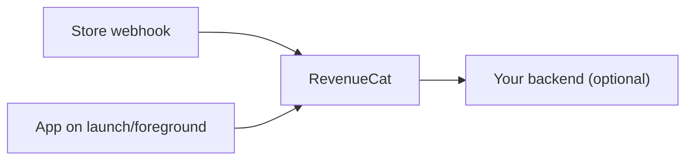

Subscription state lives on RevenueCat's servers, not on the device. The app
asks for the current entitlements; it never computes them.

### Why the indirection

Receipt validation, cross-platform state, renewals and refunds are all handled
server-side by RevenueCat. Renewals and cancellations arrive later, via store
webhooks, without the app being open — which is why the device cannot be the
source of truth for access.

### In this project

- `src/services/payments/` owns every call to the SDK.
- `src/hooks/payments/` exposes entitlement state to the UI.
- `src/features/subscriptions/` holds the paywall and management screens.

Nothing outside `services/payments/` imports `react-native-purchases`.
