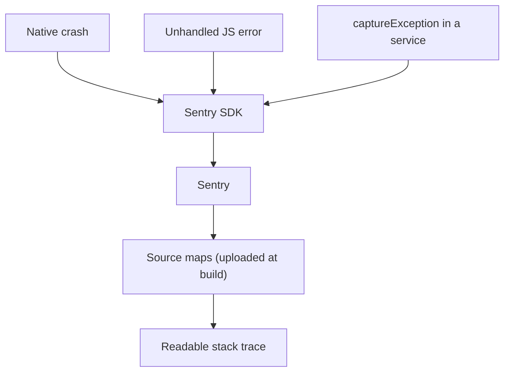

Errors reach Sentry from three places, and only the third needs any code:

Native crashes and unhandled JavaScript errors are captured automatically once
`init` has run. Deliberate captures exist to add context — which feature, which
operation — to failures the app already handles.

Source maps are uploaded during the build, not by the app. Without them, every
production frame points at a minified bundle, which is why verifying source maps
on the first production release matters more than any amount of instrumentation.

In this project, `Sentry.init()` runs once at startup and
`src/services/monitoring/` wraps it, so no feature code imports the SDK
directly.
