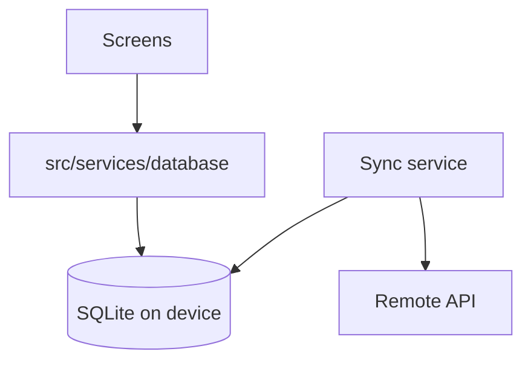
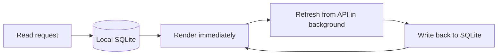
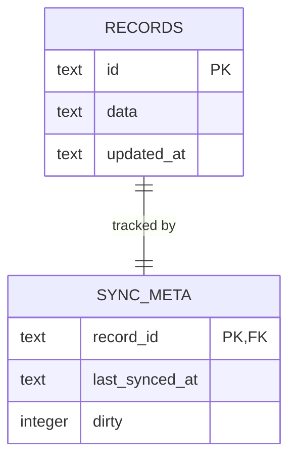

Local storage sits behind the same service boundary as the network, so screens
do not know where data came from.

### Offline-first read path

Reading locally first is what makes the app usable without a connection. The
consequence is that two copies of the data exist, so **the conflict rule must be
decided deliberately** — last-write-wins on a timestamp is usually enough, but
it silently discards one side, and that is worth stating here rather than
leaving it implicit in the sync code.

### Starter data model

Nothing here scaffolds real tables — this is a starting point to replace, not
a reflection of your actual schema. Every locally-cached row needs its own
sync bookkeeping if last-write-wins is going to work at all:

