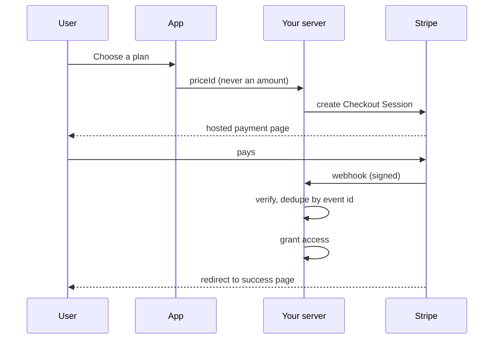
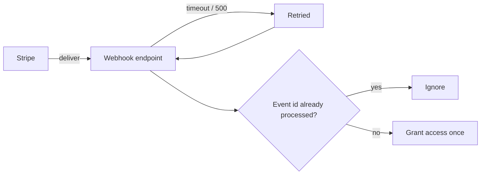

Payment state flows from Stripe to your server, never from the browser.

The redirect and the webhook are independent. The user reaching `/success`
proves only that they loaded a URL — anyone can do that. Access is granted on
the webhook.

### Why idempotency is mandatory

Delivery is at-least-once by design. Without the check, an ordinary retry —
which happens whenever your endpoint is briefly slow — grants access twice.
