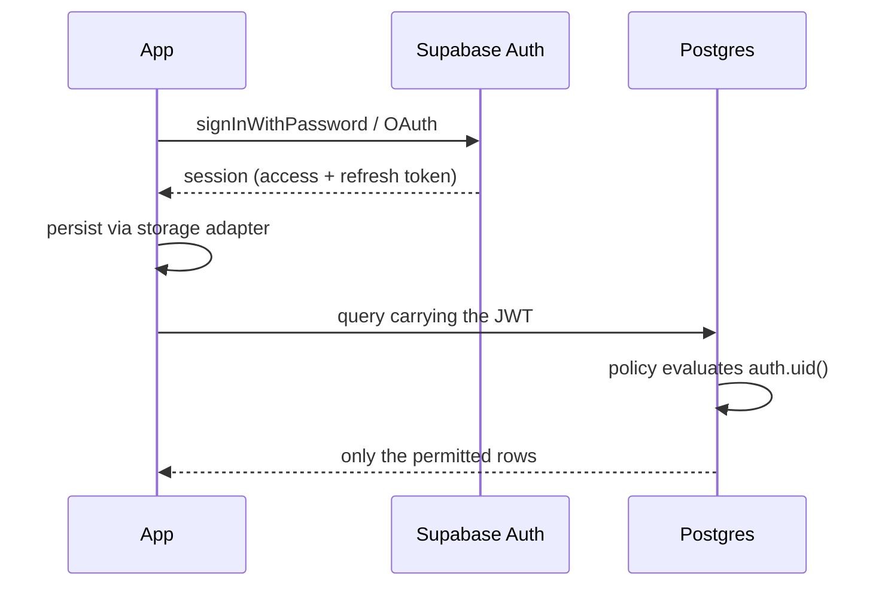
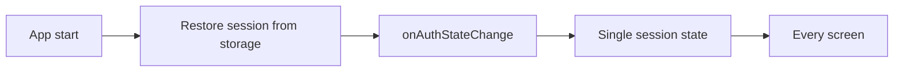

The signed-in session is a JWT that travels with every database call. Postgres
evaluates the policy; the app never decides what a user may read.

The refresh token is what keeps this working past the access token's lifetime.
Subscribing to `onAuthStateChange` once means the whole app sees the refreshed
session; polling `getSession()` per screen does not.

