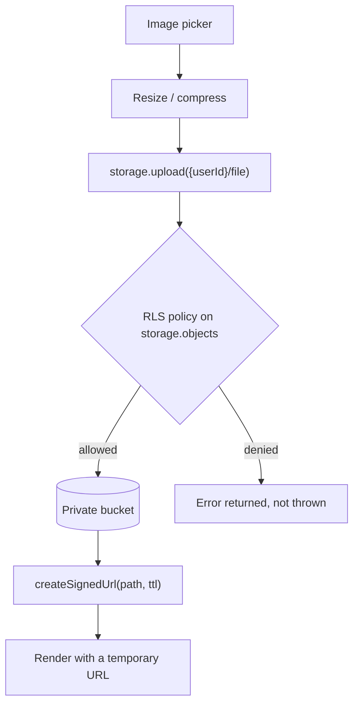

Objects are rows in `storage.objects`, so the same policy engine that guards the
database guards the files.

Two consequences worth stating explicitly:

**The path is the policy input.** Because policies match on
`storage.foldername(name)`, the `{userId}/…` convention is not a tidiness
preference — without it there is no way to express "only the owner may read
this".

**Your database stores the path, never the URL.** Signed URLs expire; a stored
one becomes a broken image with no obvious cause.
