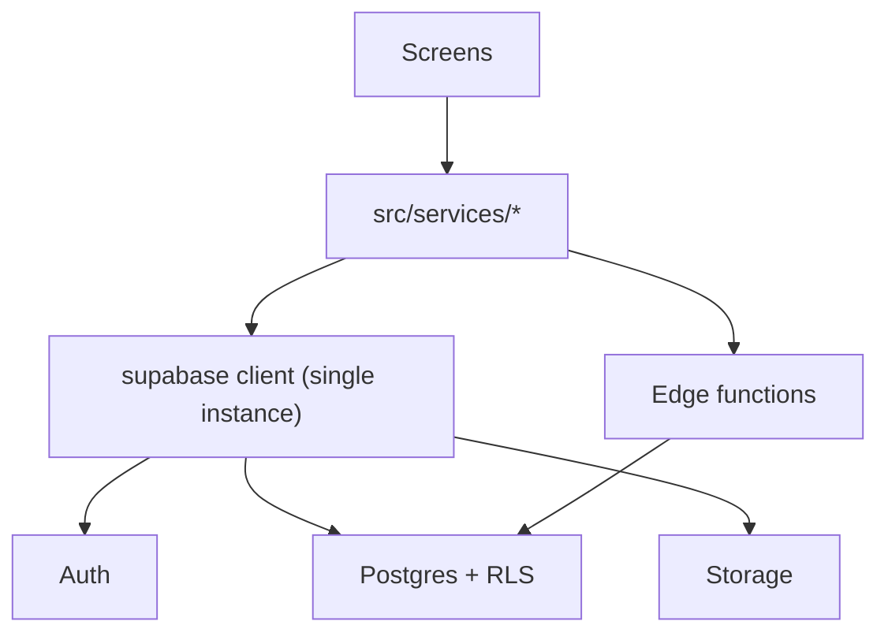
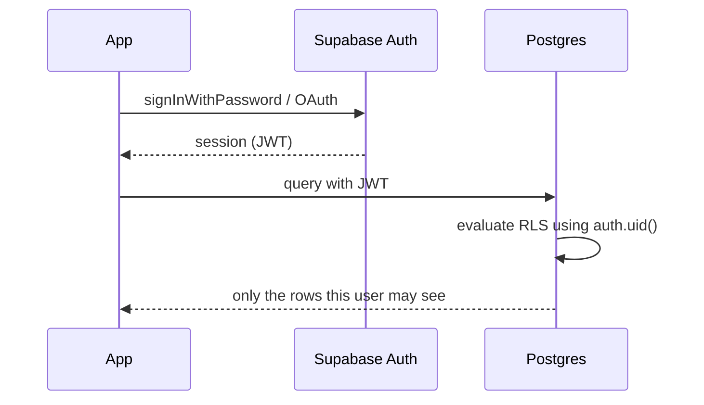

The client talks to Postgres over HTTP. There is no application server in the
middle, so the database's own Row Level Security policies are the authorisation
layer.

### Authentication flow

The JWT travels with every query, and Postgres evaluates the policy itself. The
client cannot forge `auth.uid()` — which is exactly why authorisation decisions
belong in policies rather than in application code.

### Privileged work

Anything requiring more than the signed-in user's own permissions runs in an
edge function with the service-role key, server-side. That key never reaches the
app; putting it there would bypass every policy above.
